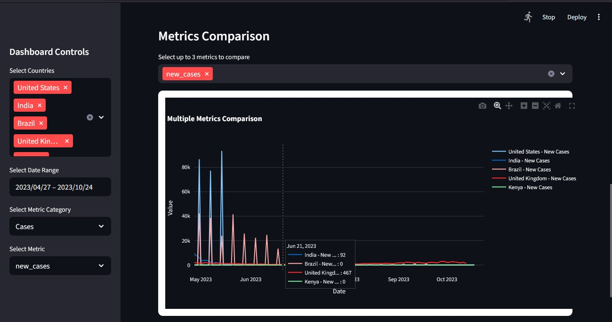

<div align="center">
  <h1 style="color: #2563eb; font-family: 'Segoe UI', Tahoma, Geneva, Verdana, sans-serif;">
    🌍 COVID-19 Global Data Tracker
  </h1>
  
  <!-- Badges -->
  <div style="margin: 10px 0 20px 0;">
    
    
    
    <a href="https://www.kaggle.com/datasets/kalilurrahman/covid19-coronavirus-dataset-by-owid">
      
    </a>
  </div>
  <p style="color: #4b5563; font-size: 1.1em; max-width: 800px; margin: 0 auto 2em auto;">
    An interactive tracker for COVID-19 trends worldwide. Analyze cases, deaths, recoveries, and vaccinations with clean visualizations and reproducible notebooks.
  </p>
  
  <div style="background-color: #f3f4f6; border-radius: 8px; padding: 20px; margin: 20px 0; text-align: left;">
    <h3 style="color: #1f2937; border-bottom: 2px solid #2563eb; display: inline-block; padding-bottom: 5px;">📋 Quick Start</h3>
    <div style="background: white; padding: 15px; border-radius: 6px; margin: 10px 0;">
      <code style="background: #f0f0f0; padding: 10px 15px; border-radius: 4px; display: block; overflow-x: auto;">
        git clone https://github.com/secbyteX03/covid19-data-tracker.git<br>
        cd covid19-data-tracker<br>
        pip install -r requirements.txt<br>
        jupyter notebook
      </code>
    </div>
  </div>
</div>

## 🎯 Project Objectives

This project aims to:
- Provide an interactive platform for exploring global COVID-19 data
- Visualize key pandemic metrics including cases, deaths, and vaccination progress
- Enable data-driven insights through comprehensive analysis
- Serve as an educational resource for data analysis and visualization
- Support research and decision-making with reliable, up-to-date information

## 🎯 Who Is This For?

This project is designed for:
- **Students** learning data analysis and visualization
- **Researchers** studying pandemic trends and patterns
- **Data Analysts** looking for COVID-19 insights
- **Public Health Professionals** tracking vaccination progress
- **Anyone** interested in understanding the global impact of COVID-19

## 📸 Preview


*Interactive dashboard showing global COVID-19 statistics and trends*

## 🔄 How It Works

1. **Data Collection**: Fetches the latest COVID-19 data from Our World in Data
2. **Data Processing**: Cleans and processes the data for analysis
3. **Analysis**: Performs statistical analysis and generates insights
4. **Visualization**: Creates interactive charts and dashboards
5. **Reporting**: Generates comprehensive reports and summaries

## 📊 Project Overview
<div style="background-color: #f8fafc; border-left: 4px solid #2563eb; padding: 15px; margin: 15px 0; border-radius: 0 4px 4px 0;">
  This project provides a comprehensive analysis of global COVID-19 data, including cases, deaths, recoveries, and vaccination progress across different countries. The analysis is presented through interactive visualizations, detailed reports, and an intuitive dashboard.
</div>

## 🏗️ Project Structure
```
covid19-global-tracker/
├── data/                 # Raw and processed data files
├── notebooks/            # Jupyter notebooks for analysis
│   └── covid19_analysis.ipynb  # Main analysis notebook
├── output/               # Analysis outputs and visualizations
├── src/                  # Source code and utility functions
└── dashboard.py          # Interactive dashboard application
```

## 🚀 Features

<div style="display: grid; grid-template-columns: repeat(auto-fit, minmax(300px, 1fr)); gap: 15px; margin: 20px 0;">
  <div style="background: white; border-radius: 8px; padding: 15px; box-shadow: 0 2px 4px rgba(0,0,0,0.1);">
    <h4 style="color: #2563eb; margin-top: 0;">Interactive Visualizations</h4>
    <p style="color: #4b5563; margin-bottom: 0;">Explore COVID-19 trends through dynamic and interactive charts.</p>
  </div>
  
  <div style="background: white; border-radius: 8px; padding: 15px; box-shadow: 0 2px 4px rgba(0,0,0,0.1);">
    <h4 style="color: #2563eb; margin-top: 0;">Vaccination Tracking</h4>
    <p style="color: #4b5563; margin-bottom: 0;">Monitor global vaccination progress and rates across countries.</p>
  </div>
  
  <div style="background: white; border-radius: 8px; padding: 15px; box-shadow: 0 2px 4px rgba(0,0,0,0.1);">
    <h4 style="color: #2563eb; margin-top: 0;">Data Analysis</h4>
    <p style="color: #4b5563; margin-bottom: 0;">Comprehensive statistical analysis of pandemic trends.</p>
  </div>
</div>

## 🛠️ Tools and Libraries Used

### Core Technologies
- **Python 3.9+**: Primary programming language
- **Jupyter Notebooks**: Interactive data analysis and visualization
- **Pandas**: Data manipulation and analysis
- **Matplotlib/Seaborn**: Data visualization
- **Plotly/Dash**: Interactive dashboard components
- **NumPy**: Numerical computing
- **scikit-learn**: Machine learning and statistical modeling

### Data Processing
- **Pandas**: Data cleaning and transformation
- **NumPy**: Numerical operations
- **DateTime**: Date and time manipulation

### Visualization
- **Matplotlib/Seaborn**: Static visualizations
- **Plotly/Dash**: Interactive visualizations
- **Folium**: Geospatial visualizations

## 🚀 How to Run/View the Project

### Prerequisites
- Python 3.9 or higher
- pip (Python package installer)
- Git (for cloning the repository)

### Installation Steps

1. **Clone the repository**
   ```bash
   git clone https://github.com/secbyteX03/covid19-data-tracker.git
   cd covid19-data-tracker
   ```

2. **Set up a virtual environment** (recommended)
   ```bash
   python -m venv venv
   # On Windows:
   venv\Scripts\activate
   # On macOS/Linux:
   source venv/bin/activate
   ```

3. **Install dependencies**
   ```bash
   pip install -r requirements.txt
   ```

4. **Launch the application**
   - For Jupyter Notebook analysis:
     ```bash
     jupyter notebook
     ```
     Then open `notebooks/covid19_analysis.ipynb`
   
   - For the interactive dashboard:
     ```bash
     streamlit run dashboard.py
     ```
     This will automatically open the dashboard in your default web browser

### Viewing Pre-generated Reports
- Check the `output/` directory for pre-generated reports and visualizations
- `covid_insights.md` contains key findings and analysis
- `summary_statistics.json` includes comprehensive statistical summaries

1. **Clone the repository**
   ```bash
   git clone https://github.com/secbyteX03/covid19-data-tracker.git
   cd covid19-data-tracker
   ```

2. **Create and activate a virtual environment** (recommended)
   ```bash
   python -m venv venv
   source venv/bin/activate  # On Windows use `venv\Scripts\activate`
   ```

3. **Install dependencies**
   ```bash
   pip install -r requirements.txt
   ```

4. **Launch the application**
   - For Jupyter Notebook:
     ```bash
     jupyter notebook
     ```
   - For the dashboard:
     ```bash
     python dashboard.py
     ```

## 📥 Getting the Data

1. Download the dataset from [Kaggle](https://www.kaggle.com/datasets/kalilurrahman/covid19-coronavirus-dataset-by-owid)
2. Create a `data` directory in the project root if it doesn't exist
3. Place the downloaded `owid-covid-data.csv` file in the `data/` directory
4. You're ready to run the analysis!

## 📈 Data Source

- [COVID-19 Coronavirus Dataset by Our World in Data (OWID) on Kaggle](https://www.kaggle.com/datasets/kalilurrahman/covid19-coronavirus-dataset-by-owid?select=owid-covid-data.csv)  
  This dataset, curated by Our World in Data and hosted on Kaggle, contains comprehensive global COVID-19 statistics including cases, deaths, testing, hospitalizations, and vaccination data. It serves as the sole data source for this project, ensuring consistency and reliability across all analyses and visualizations.

## 💡 Insights and Reflections

### Key Findings
- The data reveals significant variations in COVID-19 impact across different regions
- Vaccination rates show strong correlation with reduced severe outcomes
- The pandemic has demonstrated waves of infection with distinct patterns
- Government responses and public health measures show varying effectiveness

### Challenges Faced
- Data quality and consistency across different regions
- Handling missing or incomplete data points
- Creating visualizations that effectively communicate complex trends
- Ensuring the dashboard remains performant with large datasets

### Lessons Learned
- The importance of data cleaning and preprocessing
- Effective visualization techniques for time-series data
- The value of interactive elements in data exploration
- How to handle and visualize large-scale epidemiological data

## 🚀 Future Work

Planned improvements and features:
- [ ] Real-time data updates
- [ ] Country comparison tool
- [ ] Predictive modeling
- [ ] More interactive visualizations
- [ ] Mobile-responsive dashboard
- [ ] Export functionality for reports and charts


## 📚 Documentation

Detailed documentation and API references are available in the `docs/` directory.

## 🤝 Contributing

Contributions are welcome! Please read our [Contributing Guidelines](CONTRIBUTING.md) for details on our code of conduct and the process for submitting pull requests.


## 📬 Contact

For any inquiries or feedback, please open an issue in the repository.


## 📄 License

This project is licensed under the MIT License - see the [LICENSE](LICENSE) file for details.